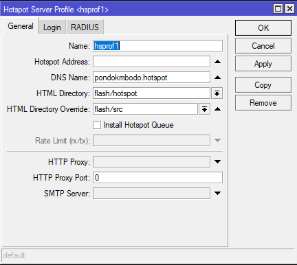
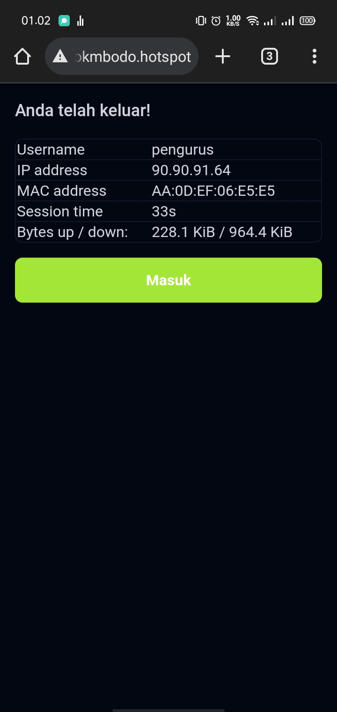

# Mikrotik Hotspot Template

Ini adalah project yang saya buat untuk belajar memodifikasi template hostpot mikrotik dengan tailwind css.

Default Hotspot Template berada pada branch `default` cek [disini](https://github.com/lyrihkaesa/mikrotik-hotspot-template/tree/default).

Untuk template yang lain kemungkinan akan saya taruh di beda-beda branch. Untuk sekarang:

- `main` = `tailwind-3/pondokmbodo`

## Cara memasang templatenya

Buka Hotspot Server Profile pada `IP` > `Hotspot` > Tap `Server Profile` > Pilih profile hotspot, misal: `hsprof1` > Tap `General` > Silahkan masukan direktori/folder dari template hostspot yang sudah anda unduh pada `HTML Directory Override`.

Okay penjelasannya gini:

Saya tidak mengubah pada `HTML Directory` itu karena default template hotspot mikrotik itu berada pada direcotry `flash/hostspot`, jika template hostpot saya yang berada di direkotry `flash/src` tidak ada maka defaultnya akan menggunakan template hostpot mikrotik itu sendiri, jadi saya lebih memilih menggunakan `HTML Directory Override` daripada mengganti `HTML Directory`. Anda dapat membacanya disini: <https://wiki.mikrotik.com/Manual:Customizing_Hotspot#HTML_customizations>

Informasi tambahan `src` ini yaa `source` kode sumber dari template hotspot yang saya buat, kenapa saya pisah ke folder `src` supaya tinggal `drag and drop` langsung di `Files` pada `Winbox` tanpa harus menghapus beberapa file yang tidak terpakai seperti:

- README.md
- .git
- .gitignore
- dsb.

Dimana file diatas tidak diperlukan malahan membuat **storage flash pada mikrotik kita PENUH**.

## Gambaran `tailwind-3/pondokmbodo`

Yang sudah dimodifikasi:

- [x] Login Voucher
- [x] Login Member (Anggota)
- [ ] Login Trial
- [x] Login Redirect
- [x] Logout
- [ ] Status

| Login Voucher                                   | Login Member                                  |
| ----------------------------------------------- | --------------------------------------------- |
|  |  |

| Login Redirect                                    | Logout                            |
| ------------------------------------------------- | --------------------------------- |
|  |  |
